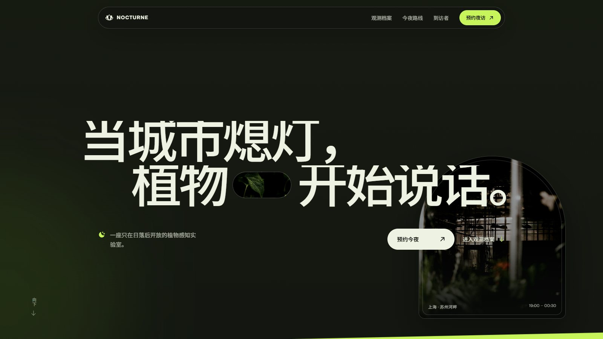

# NOCTURNE 夜植观测所



使用 `gpt-taste` 独立完成的 React 网站作品。

## 本地运行

执行生产构建后，文件会输出到 `dist`。

开发方式：

```powershell
npm install
npm run dev
```

生产构建：

```powershell
npm run build
```

## 已实现

- 桌面与手机响应式页面
- GSAP 逐词滚动显影与图像缩放淡出
- 首屏温室的指针跟随 3D 景深，以及桌面档案段落的滚动钉住
- 无空洞 Bento 档案区
- 移动导航、到访者轮播
- 完整预约场次选择、邮箱校验与确认状态
- `prefers-reduced-motion`、键盘焦点与语义化标签

## 本轮质感优化

- 将随机占位图全部替换为本地高分辨率夜间温室、植物微距和人物影像
- 重做首屏的暗部、景深、玻璃高光与胶片颗粒层，保持正文可读性
- 为馆藏标题加入短距离 ScrollTrigger 钉住，并保留移动端自然滚动
- 完成 1440、390、320 像素实机验证；无横向溢出、无图片加载失败

影像发现页与来源说明见 `public/media/SOURCES.txt`。
