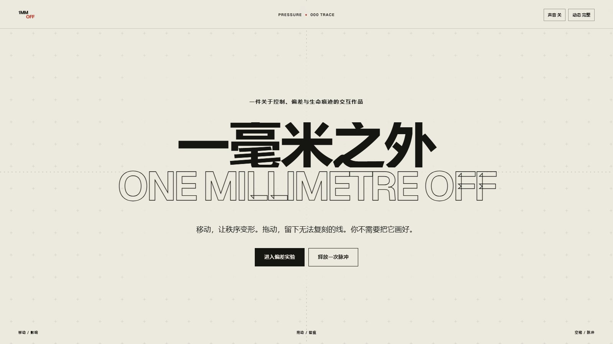

# 一毫米之外 / ONE MILLIMETRE OFF



一件关于控制、偏差与生命痕迹的本地交互作品。

它把浏览器变成一张会回应人的校准纸：指针会挤压网格，拖动会留下不可复刻的线，空格会释放穿过整张纸的偏差脉冲。作品不会自动替用户制造“漂亮结果”，也不会上传任何数据。

## 操作

- 移动指针：影响校准网格
- 按住并拖动：留下个人轨迹
- 空格：释放一次脉冲
- 数字键 `1` / `2` / `3`：切换压力、漂移、回声
- `M`：开关本地生成声音，默认关闭
- `R`：切换减弱动态
- `C`：清空轨迹
- “封存为图像”：下载当前轨迹的 1600 × 2000 PNG

## 本地运行

```powershell
npm install
npm run build
npm run preview -- --host 127.0.0.1 --port 4401 --strictPort
```

生产构建位于 `dist/`。作品没有远程图片、API、账号或登录依赖。

## 桌面交付

- 作品目录：当前项目目录
- 打开入口：`打开《一毫米之外 ONE MILLIMETRE OFF》.lnk`
- 本地地址：`http://127.0.0.1:4401/`
- 关闭入口：作品集根目录的 `关闭本地作品服务器.lnk`

重复打开会复用同一个本地服务，不会重复占用端口。

## 验证

```powershell
npm run test:static
npm run test:e2e
```

端到端检查覆盖：正式构建资源、桌面与窄屏布局、横向溢出、控制台错误、鼠标轨迹、模式切换、键盘脉冲、减弱动态、PNG 封存、键盘入口和 WCAG 2.1 A/AA 严重问题扫描。

## 视觉系统

纸白、墨黑与单一朱砂色构成全部色彩。大面积留白、严格网格和 Geist 字体维持冷静秩序；真实输入造成的偏差是唯一不受版式控制的部分。
