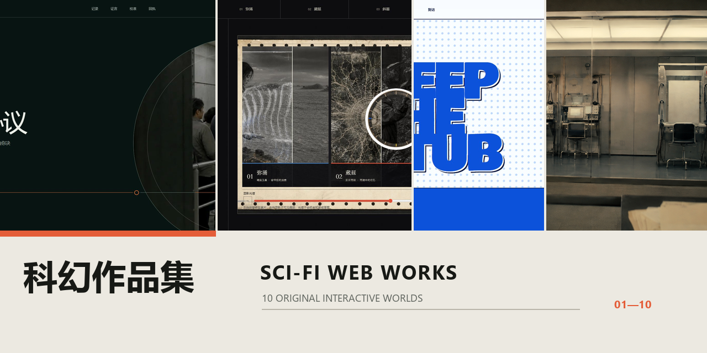
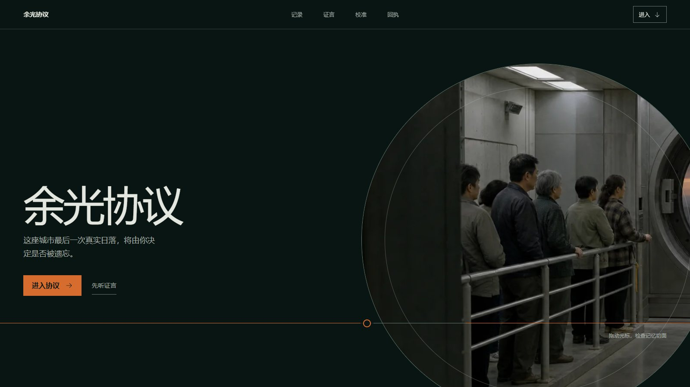
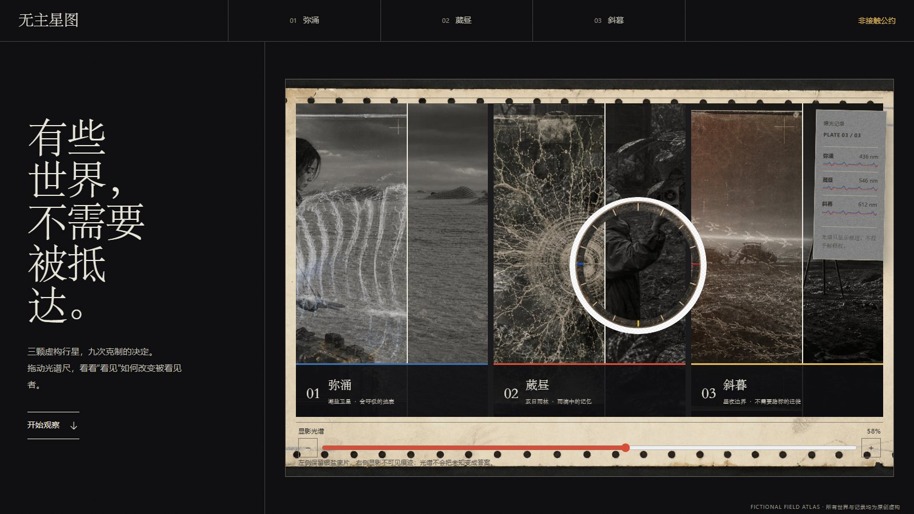
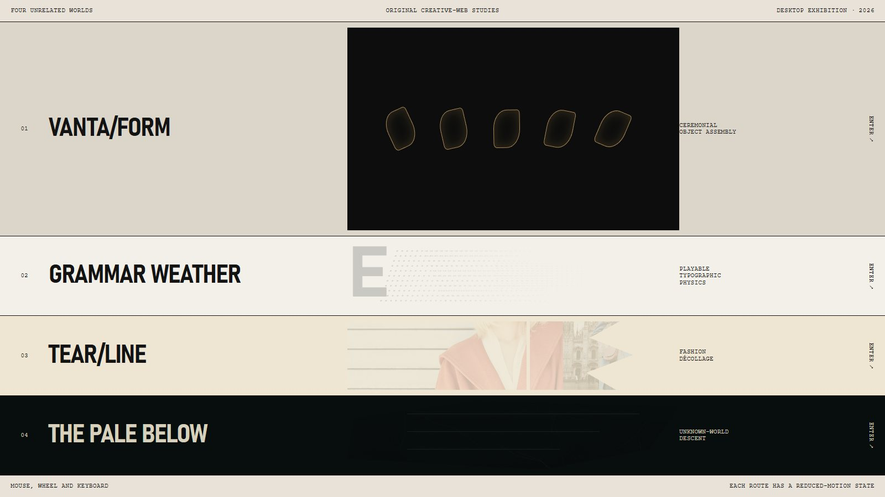
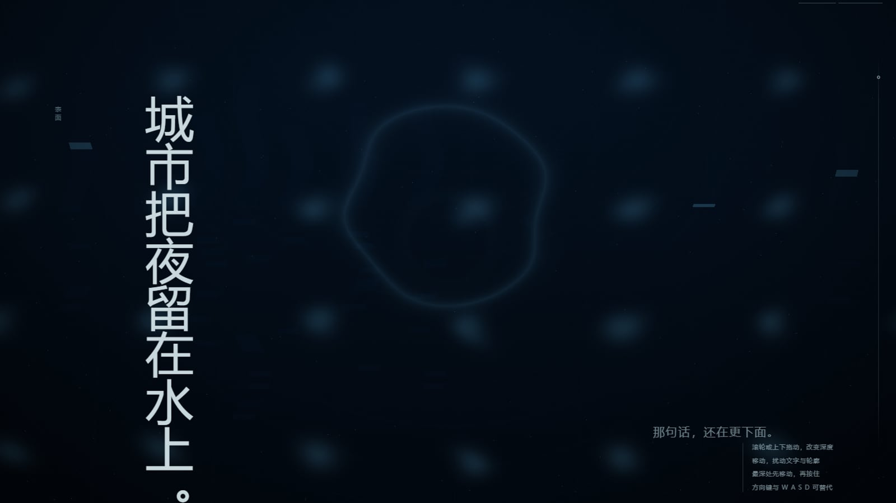
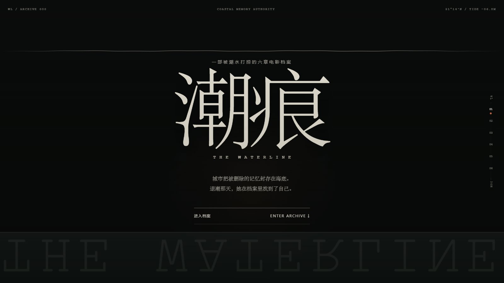
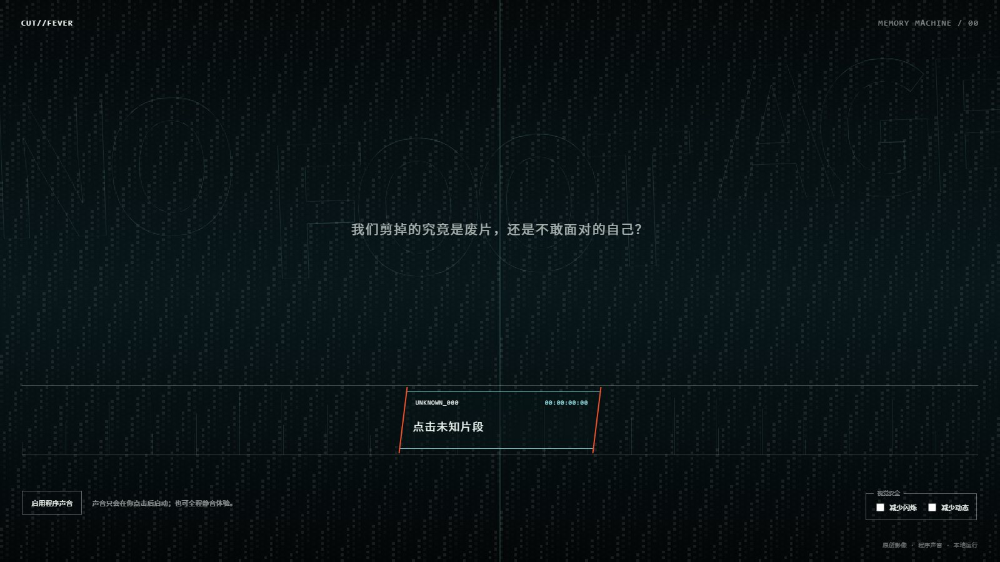
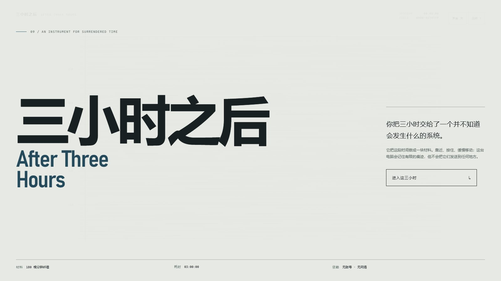

# 科幻作品集 / SCI-FI WEB WORKS

10 件原创互动网页作品，围绕记忆、观察、时间与选择展开。下方图片均截取自各项目的正式本地构建；点击图片或项目名可进入对应源码与完整说明。

## 作品展厅

<table>
  <tr>
    <td width="50%" valign="top">
      <a href="./01-余光协议/"></a><br>
      <strong>01 · <a href="./01-余光协议/">余光协议</a></strong><br>
      <sub>一部关于集体记忆、责任与安慰的互动科幻作品。</sub><br>
      <code>React</code> <code>Next.js</code> <code>Vite</code>
    </td>
    <td width="50%" valign="top">
      <a href="./02-无主星图/"></a><br>
      <strong>02 · <a href="./02-无主星图/">无主星图</a></strong><br>
      <sub>三颗虚构世界与三次撤回介入的决定，追问被发现者保持无主的权利。</sub><br>
      <code>React</code> <code>Next.js</code> <code>Vite</code>
    </td>
  </tr>
  <tr>
    <td width="50%" valign="top">
      <a href="./03-四个异世界/"></a><br>
      <strong>03 · <a href="./03-四个异世界/">四个异世界</a></strong><br>
      <sub>四种彼此独立的网页世界、视觉语言与交互机制组成的线上展厅。</sub><br>
      <code>React</code> <code>Three.js</code> <code>GSAP</code>
    </td>
    <td width="50%" valign="top">
      <a href="./04-BLUE-DIVE/"></a><br>
      <strong>04 · <a href="./04-BLUE-DIVE/">BLUE // DIVE</a></strong><br>
      <sub>以深度、扰动与停留为动作的蓝色情绪潜航。</sub><br>
      <code>React</code> <code>Three.js</code> <code>Vite</code>
    </td>
  </tr>
  <tr>
    <td width="50%" valign="top">
      <a href="./04-NOCTURNE夜植观测所/"></a><br>
      <strong>05 · <a href="./04-NOCTURNE夜植观测所/">NOCTURNE 夜植观测所</a></strong><br>
      <sub>一座在城市熄灯之后倾听植物的夜间观测所。</sub><br>
      <code>React</code> <code>GSAP</code> <code>Vite</code>
    </td>
    <td width="50%" valign="top">
      <a href="./05-KIPPU票根档案馆/"></a><br>
      <strong>06 · <a href="./05-KIPPU票根档案馆/">KIPPU 票根档案馆</a></strong><br>
      <sub>让路线、日期与纸张共同生成一张个人票根的互动档案馆。</sub><br>
      <code>React</code> <code>Vite</code>
    </td>
  </tr>
  <tr>
    <td width="50%" valign="top">
      <a href="./06-潮痕/"></a><br>
      <strong>07 · <a href="./06-潮痕/">潮痕 / THE WATERLINE</a></strong><br>
      <sub>六组镜头与证物构成的互动电影档案，水线随叙事不断改变。</sub><br>
      <code>React</code> <code>Next.js</code> <code>Vite</code>
    </td>
    <td width="50%" valign="top">
      <a href="./07-CUT-FEVER/"></a><br>
      <strong>08 · <a href="./07-CUT-FEVER/">CUT // FEVER</a></strong><br>
      <sub>介于互动电影、动态海报与实验剪辑台之间的失控编辑体验。</sub><br>
      <code>React</code> <code>Vite</code>
    </td>
  </tr>
  <tr>
    <td width="50%" valign="top">
      <a href="./08-一毫米之外/"></a><br>
      <strong>09 · <a href="./08-一毫米之外/">一毫米之外</a></strong><br>
      <sub>把浏览器变成会回应观看者的校准纸，记录控制之外的偏差。</sub><br>
      <code>React</code> <code>GSAP</code> <code>Vite</code>
    </td>
    <td width="50%" valign="top">
      <a href="./09-三小时之后/"></a><br>
      <strong>10 · <a href="./09-三小时之后/">三小时之后</a></strong><br>
      <sub>由 180 根分钟纤维组成、会记住停留与触碰的时间场。</sub><br>
      <code>JavaScript</code> <code>Canvas</code> <code>Vite</code>
    </td>
  </tr>
</table>

## 本地运行

建议安装 Node.js 20 LTS。进入任意项目目录后，根据该目录的锁文件安装依赖并启动：

```powershell
cd "01-余光协议"
npm install
npm run dev
```

`03-四个异世界` 使用 `pnpm-lock.yaml`，建议运行：

```powershell
corepack enable
cd "03-四个异世界"
pnpm install
pnpm dev
```

各项目支持的构建与测试命令以各自的 `package.json` 和 README 为准。

## 仓库整理规则

本仓库保存源码、必要素材与公开预览图。第三方依赖、构建输出、测试报告、开发工具缓存、Windows 快捷方式和重复版本备份不进入 Git，它们可以通过安装依赖、执行构建或从原始交付重新生成。

仓库没有附加开源许可证，默认保留作者权利。
